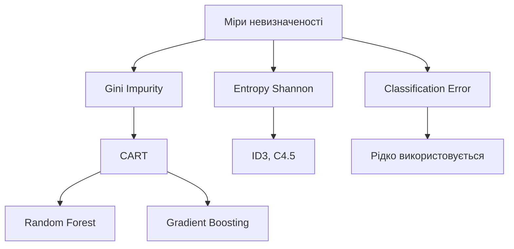

## Визначення

**Gini Impurity** — це міра невизначеності або "забрудненості" набору даних, яка показує ймовірність неправильної класифікації випадково обраного елемента.

**Головна ідея:** Gini показує, наскільки змішаними є класи в наборі даних. Чим нижче значення, тим чистіше розділення.

## Формула
$$Gini(S) = 1 - \sum_{i=1}^{n} p_i^2$$

де:
- $p_i$ — ймовірність (частка) класу $i$ в наборі
- $n$ — кількість класів

### Альтернативна форма
$$Gini(S) = \sum_{i=1}^{n} p_i \cdot (1 - p_i)$$

Це показує суму ймовірностей помилкової класифікації для кожного класу.

## Простий приклад: бінарна класифікація

### Випадок 1: Ідеальне розділення

Набір з 10 елементів:

- **Клас A**: 10
- **Клас B**: 0

$$Gini = 1 - (1^2 + 0^2) = 1 - 1 = 0$$

**Висновок:** Gini = 0 означає абсолютну чистоту (всі елементи одного класу)

### Випадок 2: Максимальна невизначеність

Набір з 10 елементів:

- **Клас A**: 5
- **Клас B**: 5

$$Gini = 1 - (0.5^2 + 0.5^2) = 1 - 0.5 = 0.5$$

**Висновок:** Gini = 0.5 означає максимальну невизначеність для бінарної класифікації

### Випадок 3: Часткова невизначеність

Набір з 10 елементів:

- **Клас A**: 7
- **Клас B**: 3

$$Gini = 1 - (0.7^2 + 0.3^2) = 1 - (0.49 + 0.09) = 0.42$$

## Складний приклад: дерево рішень для схвалення кредиту

### Вихідні дані

100 заявок на кредит:

- **Схвалено**: 60
- **Відхилено**: 40

### Початкова невизначеність
$$Gini(S) = 1 - \left(\frac{60}{100}\right)^2 - \left(\frac{40}{100}\right)^2$$
$$Gini(S) = 1 - 0.36 - 0.16 = 0.48$$

### Ознака 1: "Дохід > 50,000"

| Дохід | Схвалено | Відхилено | Всього |
|-------|----------|-----------|--------|
| Так (>50k) | 50 | 10 | 60 |
| Ні (≤50k) | 10 | 30 | 40 |

**Gini для підмножин:**

**Високий дохід:**
$$Gini(Так) = 1 - \left(\frac{50}{60}\right)^2 - \left(\frac{10}{60}\right)^2$$
$$Gini(Так) = 1 - 0.694 - 0.028 = 0.278$$

**Низький дохід:**
$$Gini(Ні) = 1 - \left(\frac{10}{40}\right)^2 - \left(\frac{30}{40}\right)^2$$
$$Gini(Ні) = 1 - 0.063 - 0.563 = 0.375$$

**Зважена невизначеність після розділення:**
$$Gini_{weighted} = \frac{60}{100} \cdot 0.278 + \frac{40}{100} \cdot 0.375$$
$$Gini_{weighted} = 0.167 + 0.150 = 0.317$$

**Gini Gain (зменшення невизначеності):**
$$Gini\ Gain = 0.48 - 0.317 = 0.163$$

### Ознака 2: "Кредитна історія"

| Історія | Схвалено | Відхилено | Всього |
|---------|----------|-----------|--------|
| Добра | 55 | 5 | 60 |
| Погана | 5 | 35 | 40 |

**Gini для підмножин:**

**Добра історія:**
$$Gini(Добра) = 1 - \left(\frac{55}{60}\right)^2 - \left(\frac{5}{60}\right)^2$$
$$Gini(Добра) = 1 - 0.840 - 0.007 = 0.153$$

**Погана історія:**
$$Gini(Погана) = 1 - \left(\frac{5}{40}\right)^2 - \left(\frac{35}{40}\right)^2$$
$$Gini(Погана) = 1 - 0.016 - 0.766 = 0.219$$

**Зважена невизначеність:**
$$Gini_{weighted} = \frac{60}{100} \cdot 0.153 + \frac{40}{100} \cdot 0.219$$
$$Gini_{weighted} = 0.092 + 0.088 = 0.180$$

**Gini Gain:**
$$Gini\ Gain = 0.48 - 0.180 = 0.300$$

### Порівняння ознак

| Ознака | Gini після розділення | Gini Gain | Висновок |
|--------|----------------------|-----------|----------|
| Дохід > 50,000 | 0.317 | 0.163 | Добра ознака |
| Кредитна історія | 0.180 | 0.300 | **Краща ознака** ✓ |

**Рішення:** Кредитна історія має більший Gini Gain, тому це краща ознака для першого розділення в дереві рішень.

## Багатокласова класифікація

### Приклад: класифікація фруктів

Набір з 30 фруктів:

- **Яблука**: 12 (40%)
- **Апельсини**: 10 (33.3%)
- **Банани**: 8 (26.7%)

$$Gini = 1 - (0.4^2 + 0.333^2 + 0.267^2)$$
$$Gini = 1 - (0.16 + 0.111 + 0.071)$$
$$Gini = 1 - 0.342 = 0.658$$

### Максимальна невизначеність для n класів

Для рівномірного розподілу між $n$ класами:
$$Gini_{max} = 1 - n \cdot \left(\frac{1}{n}\right)^2 = 1 - \frac{1}{n} = \frac{n-1}{n}$$

| Кількість класів | Максимальна Gini |
|------------------|------------------|
| 2 | 0.5 |
| 3 | 0.667 |
| 4 | 0.75 |
| 10 | 0.9 |

## Порівняння: Gini vs Entropy

### Формули
| Міра | Формула | Діапазон |
|------|---------|----------|
| **Gini** | $1 - \sum p_i^2$ | [0, 0.5] для 2 класів |
| **Entropy** | $-\sum p_i \log_2 p_i$ | [0, 1] для 2 класів |

### Приклад порівняння

Розподіл: 70% / 30%

**Gini:**
$$Gini = 1 - (0.7^2 + 0.3^2) = 1 - 0.58 = 0.42$$

**Entropy:**
$$H = -(0.7 \log_2 0.7 + 0.3 \log_2 0.3) = 0.88 \text{ біт}$$

### Графік порівняння (бінарна класифікація)
```
Gini та Entropy для різних розподілів (p, 1-p):

p     | Gini  | Entropy
------|-------|--------
0.0   | 0.00  | 0.00
0.1   | 0.18  | 0.47
0.2   | 0.32  | 0.72
0.3   | 0.42  | 0.88
0.4   | 0.48  | 0.97
0.5   | 0.50  | 1.00  ← Максимум
0.6   | 0.48  | 0.97
0.7   | 0.42  | 0.88
0.8   | 0.32  | 0.72
0.9   | 0.18  | 0.47
1.0   | 0.00  | 0.00
```

### Ключові відмінності

| Характеристика | Gini | Entropy |
|----------------|------|---------|
| **Швидкість обчислення** | Швидше ✓ (без логарифмів) | Повільніше (з логарифмами) |
| **Чутливість** | Менш чутлива до змін | Більш чутлива |
| **Використання** | CART, Random Forest | ID3, C4.5 |
| **Математична основа** | Ймовірність помилки | Теорія інформації |
| **Діапазон значень** | [0, (n-1)/n] | [0, log₂(n)] |

## Застосування

### 1. Дерева рішень (CART)

- **Classification and Regression Trees** використовують Gini для вибору розділень
- На кожному кроці обирається ознака з **найбільшим Gini Gain**

### 2. Random Forest

- Кожне дерево в ансамблі використовує Gini для побудови

### 3. Відбір ознак

- Оцінка важливості змінних
- Feature importance в scikit-learn базується на Gini

### 4. Економіка

- **Коефіцієнт Джині** для вимірювання нерівності доходів (інша формула!)

## Переваги та недоліки

### Переваги ✓

- **Швидкість**: обчислення без логарифмів
- **Простота**: інтуїтивна інтерпретація як ймовірність помилки
- **Ефективність**: добре працює на практиці
- **Числова стабільність**: без проблем з log(0)

### Недоліки ✗

- **Менша чутливість**: може пропустити тонкі відмінності
- **Схильність до збалансованих розділень**: іноді надає перевагу розділенням 50/50
- **Локальна оптимізація**: жадібний алгоритм може не знайти глобальний оптимум

## Інтерпретація значень

| Gini | Інтерпретація | Приклад |
|------|---------------|---------|
| 0.0 | Абсолютна чистота | Всі елементи одного класу |
| 0.1-0.2 | Дуже низька невизначеність | 90/10 розподіл |
| 0.3-0.4 | Помірна невизначеність | 70/30 розподіл |
| 0.5 | Максимальна невизначеність (2 класи) | 50/50 розподіл |
| 0.6+ | Висока невизначеність (3+ класи) | Рівномірний розподіл |

## Приклад коду (концептуально)

```python
def gini_impurity(labels):
    """
    Обчислення Gini impurity
    labels: список міток класів
    """
    # Підрахунок кількості кожного класу
    counts = {}
    for label in labels:
        counts[label] = counts.get(label, 0) + 1
    
    # Обчислення Gini
    total = len(labels)
    gini = 1.0
    
    for count in counts.values():
        probability = count / total
        gini -= probability ** 2
    
    return gini

# Приклад
data = ['A', 'A', 'A', 'B', 'B', 'B', 'B']
print(gini_impurity(data))  # ≈ 0.49
```

## Ключові висновки

> Gini Impurity вимірює ймовірність того, що випадково обраний елемент буде неправильно класифікований, якщо його мітку призначити випадково відповідно до розподілу міток у наборі.

- **Gini = 0** → Ідеальна чистота (всі елементи одного класу)
- **Gini = max** → Максимальна невизначеність (рівномірний розподіл)
- **Менше Gini** → Краще розділення
- **Більше Gini Gain** → Корисніша ознака

## Зв'язок з іншими метриками


**Вибір між Gini та Entropy:**

- Практично дають схожі результати
- Gini швидше обчислюється → частіше використовується
- Entropy має теоретичне обґрунтування з теорії інформації