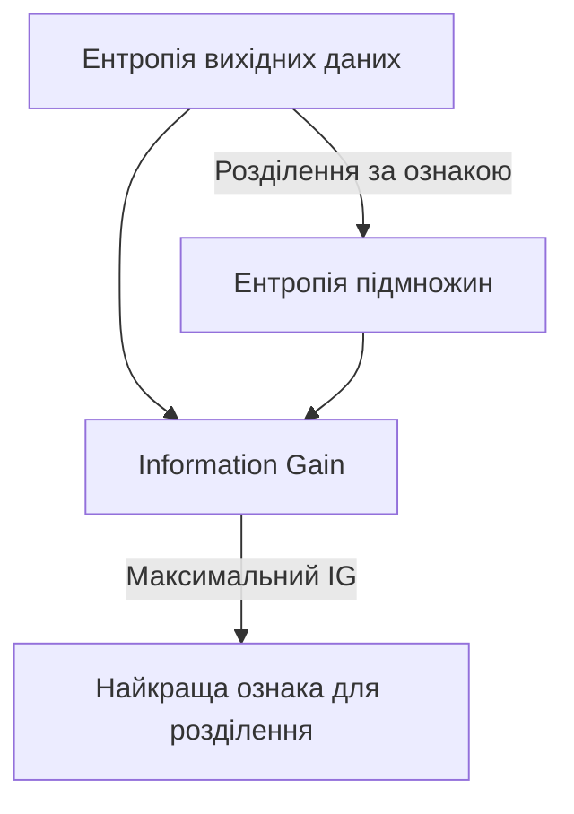

## Визначення

**Information Gain (IG)** — це міра того, наскільки зменшується невизначеність (ентропія) після розділення даних за певною ознакою.

**Головна ідея:** IG показує, наскільки корисною є певна ознака для класифікації або прийняття рішень.

## Формула
$$IG(S, A) = H(S) - \sum_{v \in Values(A)} \frac{|S_v|}{|S|} \cdot H(S_v)$$

де:
- $H(S)$ — ентропія вихідного набору даних
- $A$ — ознака, за якою ми розділяємо
- $S_v$ — підмножина даних, де ознака $A$ має значення $v$
- $\frac{|S_v|}{|S|}$ — частка елементів у підмножині

## Простий приклад: вибір фільму

### Вихідні дані

14 людей обирають, дивитися фільм чи ні:

- **Так**: 9 осіб
- **Ні**: 5 осіб

### Початкова ентропія
$$H(S) = -\frac{9}{14}\log_2(\frac{9}{14}) - \frac{5}{14}\log_2(\frac{5}{14})$$
$$H(S) \approx 0.94 \text{ біт}$$

### Розділення за ознакою "Погода"

| Погода | Так | Ні | Всього |
|--------|-----|-----|--------|
| Сонячно | 2 | 3 | 5 |
| Хмарно | 4 | 0 | 4 |
| Дощ | 3 | 2 | 5 |

### Розрахунок ентропії для кожної підмножини

**Сонячно:**
$$H(Сонячно) = -\frac{2}{5}\log_2(\frac{2}{5}) - \frac{3}{5}\log_2(\frac{3}{5}) \approx 0.97$$

**Хмарно:**
$$H(Хмарно) = -\frac{4}{4}\log_2(\frac{4}{4}) - \frac{0}{4}\log_2(\frac{0}{4}) = 0$$

**Дощ:**
$$H(Дощ) = -\frac{3}{5}\log_2(\frac{3}{5}) - \frac{2}{5}\log_2(\frac{2}{5}) \approx 0.97$$

### Зважена ентропія після розділення
$$H(S|Погода) = \frac{5}{14} \cdot 0.97 + \frac{4}{14} \cdot 0 + \frac{5}{14} \cdot 0.97$$
$$H(S|Погода) \approx 0.69$$

### Information Gain
$$IG(S, Погода) = 0.94 - 0.69 = 0.25 \text{ біт}$$

## Складний приклад: медична діагностика

### Вихідні дані

100 пацієнтів, діагноз (хвороба/здоровий):
- **Хворі**: 60
- **Здорові**: 40

### Початкова ентропія
$$H(S) = -\frac{60}{100}\log_2(\frac{60}{100}) - \frac{40}{100}\log_2(\frac{40}{100}) \approx 0.97 \text{ біт}$$

### Ознака 1: "Температура > 38°C"

| Температура | Хворі | Здорові | Всього |
|-------------|-------|---------|--------|
| Так (>38°C) | 50 | 10 | 60 |
| Ні (≤38°C) | 10 | 30 | 40 |

**Ентропія підмножин:**
- $H(Так) = -\frac{50}{60}\log_2(\frac{50}{60}) - \frac{10}{60}\log_2(\frac{10}{60}) \approx 0.65$
- $H(Ні) = -\frac{10}{40}\log_2(\frac{10}{40}) - \frac{30}{40}\log_2(\frac{30}{40}) \approx 0.81$

**Зважена ентропія:**
$$H(S|Температура) = \frac{60}{100} \cdot 0.65 + \frac{40}{100} \cdot 0.81 \approx 0.71$$

**Information Gain:**
$$IG(S, Температура) = 0.97 - 0.71 = 0.26 \text{ біт}$$

### Ознака 2: "Кашель"

| Кашель | Хворі | Здорові | Всього |
|--------|-------|---------|--------|
| Так | 55 | 25 | 80 |
| Ні | 5 | 15 | 20 |

**Ентропія підмножин:**
- $H(Так) = -\frac{55}{80}\log_2(\frac{55}{80}) - \frac{25}{80}\log_2(\frac{25}{80}) \approx 0.90$
- $H(Ні) = -\frac{5}{20}\log_2(\frac{5}{20}) - \frac{15}{20}\log_2(\frac{15}{20}) \approx 0.81$

**Зважена ентропія:**
$$H(S|Кашель) = \frac{80}{100} \cdot 0.90 + \frac{20}{100} \cdot 0.81 \approx 0.88$$

**Information Gain:**
$$IG(S, Кашель) = 0.97 - 0.88 = 0.09 \text{ біт}$$

### Порівняння ознак

| Ознака | Information Gain | Висновок |
|--------|------------------|----------|
| Температура > 38°C | 0.26 біт | Краща ознака для діагностики |
| Кашель | 0.09 біт | Менш інформативна ознака |

**Висновок:** Температура краще розділяє хворих і здорових, тому це корисніша ознака для прийняття рішення.

## Застосування

### Дерева рішень (Decision Trees)

- Алгоритм **ID3** використовує IG для вибору найкращої ознаки на кожному кроці
- Обирається ознака з **максимальним IG**

### Машинне навчання

- Відбір ознак (feature selection)
- Побудова класифікаторів
- Аналіз важливості змінних

### Аналіз даних

- Визначення найвпливовіших факторів
- Спрощення моделей

## Переваги та недоліки

### Переваги ✓

- Простота обчислення
- Інтуїтивна інтерпретація
- Ефективність для категоріальних даних

### Недоліки ✗

- **Схильність до ознак з багатьма значеннями** (bias)
- Не враховує взаємодію між ознаками
- Працює лише з дискретними розділеннями

## Альтернативи

### Gain Ratio
Нормалізована версія IG, яка враховує кількість значень ознаки:
$$GainRatio(S, A) = \frac{IG(S, A)}{SplitInfo(S, A)}$$

### Gini Impurity
Альтернативна міра для дерев рішень (використовується в CART):
$$Gini(S) = 1 - \sum_{i=1}^{n} p_i^2$$

## Ключові висновки

> Information Gain показує, наскільки зменшується невизначеність після використання певної ознаки для розділення даних.

- **Високий IG** = ознака добре розділяє класи = корисна для класифікації
- **Низький IG** = ознака погано розділяє класи = менш корисна
- **Нульовий IG** = ознака не дає жодної інформації про клас

## Зв'язок з ентропією

**Формула зв'язку:**
$$IG = H_{до} - H_{після}$$

Чим більше зменшується ентропія, тим корисніша ознака!